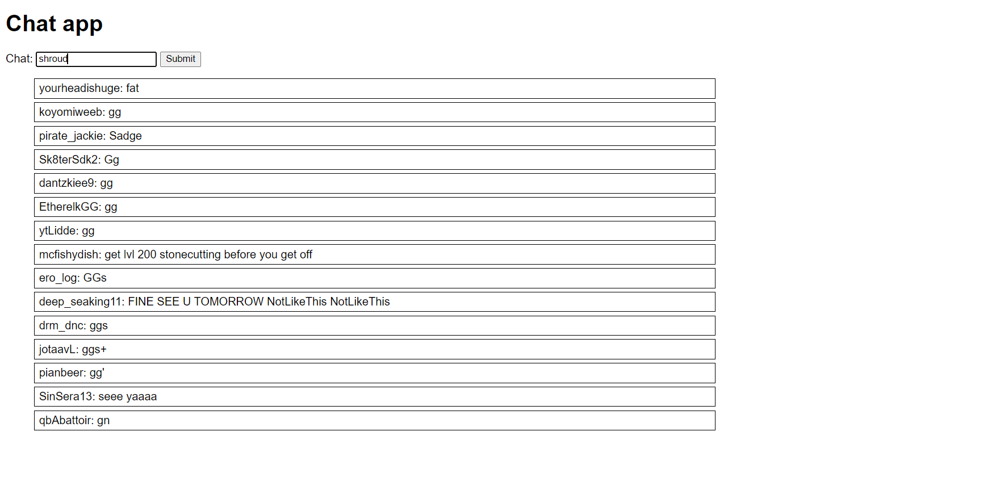

## Chat extension browser
> The twitch.tv chatextender

## Table of contents
* [General info](#general-info)
* [Screenshots](#screenshots)
* [Setup](#setup)
* [Status](#status)
* [Contact](#contact)

## General info
This is a basic browser web-page that takes a user input from a search bar and uses that input to emulate a streamer's chat on twitch.tv

## Screenshots



## Setup
There is no installation needed

## Code Examples
```
    const updateChat = (x) => {
    
    messages.push(x)
    console.log(messages)
    if (messages.length >15){
        messages.shift();
        const toDelete = messageElement.firstChild
        messageElement.removeChild(toDelete)

    }
    const list = document.createElement("li")
    list.innerText = x;
    messageElement.appendChild(list)

    }
```
Defining the function that is used to append each individual chat message to the dom, and store its value in an array. This function also empties out the first (0) index of the array when it reaches a length of 15, and removes the first index from the dom.

## Status
Project is in progress. 


## Contact
Ian Harris, ianmharris93@gmail.com || feel free to contact me.